<p align="center">
  
</p>

<p align="center">
  Founder of <a href="https://razroo.com">Razroo</a>. I build agentic systems, product architecture, and long-form work about where AI is taking us.
</p>

<p align="center">
  <a href="https://committers.top/united_states_private#CharlieGreenman">
    
  </a>
  
</p>

<p align="center">
  
  
  
  
</p>

<p align="center">
  <a href="https://razroo.com">Razroo</a> •
  <a href="https://blog.razroo.com">Blog</a> •
  <a href="https://charliegreenman.medium.com">Medium</a> •
  <a href="https://www.linkedin.com/in/charliegreenman/">LinkedIn</a> •
  <a href="https://knownunknownbook.com">Known Unknown</a> •
  <a href="https://ethosian.info">Ethos</a> •
  <a href="https://linkedindeadweight.com">DeadWeight</a> •
  <a href="https://turnkeybook.com">TurnkeyBook</a>
</p>

## Selected Outcomes

<table>
  <tr>
    <td valign="top" width="50%">
      <strong>Execution Systems</strong><br />
      Built AI ticketing workflows that can turn rough requests into 30 to 40 actionable Jira issues in seconds.
    </td>
    <td valign="top" width="50%">
      <strong>Memory-Aware Assistants</strong><br />
      Designed retrieval and semantic-context patterns that keep work moving across sessions.
    </td>
  </tr>
  <tr>
    <td valign="top" width="50%">
      <strong>Small-Team Leverage</strong><br />
      Led high-output engineering teams across product, platform, and delivery without a heavy process stack.
    </td>
    <td valign="top" width="50%">
      <strong>Long-Form Output</strong><br />
      Built a writing corpus spanning a 700-page Angular book, 200+ articles, the 14-chapter Known Unknown, and the 82-chapter Ethos.
    </td>
  </tr>
</table>

## What I Build

I work best on products that need strong architecture, fast iteration, and unusually high technical range. In practice, that usually means:

- AI product architecture and workflow automation that produce useful work, not demos
- TypeScript, JavaScript, and Python systems
- React, Angular, Node.js, and GraphQL applications
- AWS, serverless infrastructure, and data-heavy backends
- Developer experience, platform tooling, and internal products

## Experience Snapshot

- **Razroo**: Founder building AI-powered engineering tools, code generation workflows, and product systems.
- **Capital One**: Enterprise payments engineering.
- **ASCO**: Angular modernization for enterprise applications.
- **Columbia University**: Course-management software.
- **Datasite**: UI architecture for M&A software.
- **Verizon / Oath**: Frontend engineering and architecture.
- **Republic Services** and **Ruffalo Noel Levitz**: AI chat application work.

<details>
<summary>Full company timeline</summary>

- **Razroo** (2018-present): Technical founder.
- **Republic Services**: Python and React for AI chat initiatives.
- **Ruffalo Noel Levitz**: AI chat application work.
- **Capital One**: Full-stack engineer on enterprise payments systems.
- **ASCO**: Senior software engineer on Angular migrations.
- **Columbia University**: Senior software engineer on course-management systems.
- **Datasite**: UI architect leading engineers on M&A applications.
- **Verizon**: Software engineer and frontend architect for Oath advertising platforms.
- **Rubenstein Technology Group**: Frontend software engineer for AM100 law-firm products.
- **Pegasus Solutions**: Frontend architecture for booking-engine work.
- **Omnium Group**: Frontend engineer across multiple client ventures.

</details>

## Current Books and Products

| Project | What it is |
| --- | --- |
| [Known Unknown](https://knownunknownbook.com) | A free 14-chapter book exploring what happens to human life after AI changes the frame. |
| [Ethos](https://ethosian.info) | An 82-chapter secular framework for living with intention, integrity, and a long view. |
| [DeadWeight](https://linkedindeadweight.com) | A LinkedIn network-audit service focused on identifying inactive connections that suppress reach. |
| [TurnkeyBook](https://turnkeybook.com) | A done-for-you book writing service for founders, operators, and experts. |

## Selected Open Source

| Project | Focus |
| --- | --- |
| [codemorph](https://github.com/razroo/codemorph) | Cross-platform codemod tooling for maintainable code transformations. |
| [html-to-adf](https://github.com/razroo/html-to-adf) | HTML to Atlassian Document Format conversion for Jira and Confluence workflows. |
| [tyson](https://github.com/razroo/tyson) | TypeScript-style ergonomics for JSON-based DevOps configuration. |
| [reason-oop-patterns](https://github.com/CharlieGreenman/reason-oop-patterns) | Gang of Four patterns translated into Reason. |
| [angular-material-virtual-scroll-cdk-table](https://github.com/CharlieGreenman/angular-material-virtual-scroll-cdk-table) | Virtual scrolling patterns for large Angular Material datasets. |

<details>
<summary>Side projects and experiments</summary>

- [codeIllustrator](https://github.com/CharlieGreenman/codeIllustrator): a vanilla JavaScript drawing tool exploring illustration-to-code workflows.
- [Html5Tetris](https://github.com/CharlieGreenman/Html5Tetris): a browser Tetris build and an 8-bit side quest.

</details>

## Writing

- [Angular: The Full Gamut](https://github.com/razroo/angular-content): a long-form Angular book I wrote largely while commuting between Queens and Manhattan.
- [Razroo Blog](https://blog.razroo.com): technical writing on AI, architecture, and product systems.
- [Medium](https://charliegreenman.medium.com): essays, thought pieces, and newer writing.
- Gumroad mini-books: [NgRx/store](https://razroo.gumroad.com/l/ngrx-store) and [Angular Unit Testing](https://razroo.gumroad.com/l/angular-unit-testing)

One lesson I learned the hard way: do not break your own article URLs. Canonical links matter.

## How I Work

- I prefer small teams with high trust and high standards.
- I value elegant systems, direct communication, and execution over theater.
- I care most about technology that improves quality of life, expands human capability, and keeps people meaningfully in the loop.

## Working Together

If you're building an AI-first product, modernizing a platform, or need fractional technical leadership that can move from strategy to implementation, those are usually the problems I care most about. The cleanest path in is [LinkedIn](https://www.linkedin.com/in/charliegreenman/) for direct outreach or [Razroo](https://razroo.com) for company work.

<details>
<summary>Background and personal notes</summary>

Houston, Chicago, Queens, Long Island, Manhattan, Jerusalem, Tel Aviv, London, San Francisco, Los Angeles, Silver Spring, Arlington, and Alexandria.

Living across that many places shaped how I build: move fast, stay adaptable, and do not confuse polish with substance.

Greenman House ethos: [Project Creed / ethos](https://github.com/Project-Creed/ethos)


8-bit intermission:

```text
      .------------------------------------------------.
      | TETRIS                               PORTABLE  |
      |------------------------------------------------|
      | SCORE 015840     LEVEL 05         LINES 127    |
      |                                                |
      |  .--------------------.        NEXT    []      |
      |  |                    |                []      |
      |  |                    |                []      |
      |  |                    |                []      |
      |  |                    |                        |
      |  |        [][]        |        HOLD   [][]     |
      |  |        [][]        |               [][]     |
      |  |                    |                        |
      |  |                    |        FIELD  10x20    |
      |  |                    |        PIECES 389      |
      |  |                    |        SPEED  01G      |
      |  |                    |                        |
      |  |[]  [][]  []  [][]  |        A  ROTATE       |
      |  |[][]  [][]  [][]  []|        B  DROP         |
      |  |[]  [][]  [][]  [][]|        START PAUSE     |
      |  |[][]  []  [][]  []  |                        |
      |  '===================='                        |
      '------------------------------------------------'
```

</details>

## Vir Viridis Vivit

Latin for "the green man lives," and a small piece of personal symbolism and visual worldbuilding.


